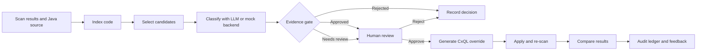

<div align="center">

# TrueSignal

### Evidence-gated SAST triage for Java applications

Turn project-specific security knowledge into explainable, reversible Checkmarx CxQL improvements.

[](https://www.python.org/)
[](https://flask.palletsprojects.com/)
[](https://checkmarx.com/)
[](#quick-start)

</div>

> **The safety rule:** nothing is applied on the LLM's word alone.
>
> Every proposed classification passes through deterministic code-evidence checks and human review. Every applied override is recorded in an audit ledger and can be rolled back.

## Why TrueSignal?

SAST tools are excellent at finding suspicious data flows, but they cannot automatically know that a customer-specific wrapper sanitizes input, exposes a trusted source, or reaches a security-sensitive sink. That missing project context can create repeated false positives, hide real vulnerabilities, and consume valuable AppSec time.

TrueSignal closes that feedback loop without turning security decisions into an opaque model action. It indexes Java code, learns candidate semantics, verifies them against evidence, generates CxQL overrides, and compares the next scan with the previous one.

## What it does

| Capability | Outcome |
| --- | --- |
| **Code-aware learning** | Finds candidate sanitizers, sources, and sinks in Java code. |
| **Evidence-gated AI** | Combines model reasoning with deterministic index and triage evidence. |
| **Human review** | Makes proposed learnings visible before they affect scan behavior. |
| **CxQL override generation** | Converts approved semantics into project-specific Checkmarx overrides. |
| **Impact comparison** | Shows downgraded false positives and newly surfaced findings after a re-scan. |
| **Audit and rollback** | Keeps append-only JSON history for decisions, overrides, feedback, and run summaries. |
| **Confidence calibration** | Adjusts confidence with bounded, explainable counters rather than opaque model weights. |
| **CxQL Assistant** | Provides grounded CxQL guidance from the bundled API guide. |
| **Attack Surface Radar** | Compares open exposure with learned coverage across attack classes. |
| **Offline demo mode** | Runs deterministically with fixtures and no API keys or network access. |

## Workflow



The same pipeline powers the command-line interface and Flask web application:

1. Ingest scan data and source code.
2. Index methods, calls, source hints, and sink hints.
3. Select functions worth classifying.
4. Ask the configured classifier for a role, confidence, attack classes, and code reasons.
5. Verify the response against deterministic evidence and triage history.
6. Review and approve proposed learnings.
7. Generate and apply CxQL overrides.
8. Re-scan, compare findings, and record the outcome.

## Safety model

TrueSignal is intentionally conservative because an incorrect sanitizer classification can create a false negative.

- **Sanitizers** require concrete code evidence and enough supporting triage history before automatic approval.
- **Sources and sinks** require independent confirmation from the code indexer.
- **Low-confidence or weakly supported classifications** are rejected or sent to review.
- **Feedback calibration** is bounded to `+/-0.10` and uses explainable counters by role and attack class.
- **Training data** is exported only after administrator review when the Ollama fine-tuning workflow is used.
- **Applied overrides** are visible in the ledger and reversible.

The verification implementation lives in [`truesignal/verifier.py`](truesignal/verifier.py). The default gate values are a minimum confidence of `0.85` and at least `3` supporting triage decisions; both can be configured.

## Quick start

### 1. Install

```bash
python -m venv venv

# macOS/Linux
source venv/bin/activate

# Windows PowerShell
.\venv\Scripts\Activate.ps1

pip install -e ".[web,test]"
```

For the optional local Ollama fine-tuning workflow, install the additional `finetune` dependency group.

### 2. Start the web UI

```bash
python run.py
```

Open [http://127.0.0.1:5000](http://127.0.0.1:5000). The application starts in deterministic mock mode, seeds the built-in demo projects, and requires no credentials or network access.

Default demo accounts:

| Role | Username | Password |
| --- | --- | --- |
| Admin | `admin` | `checkmarx` |
| AppSec | `appsec` | `checkmarx` |

Change these credentials before exposing the application outside a local demo.

### 3. Run the complete offline pipeline

```bash
python run.py full
```

This runs the fixture-backed workflow against the `webshop` demo: tests, ingest, analysis, ledger updates, and result comparison.

## CLI reference

After installation, the `truesignal` command is available. You can also use `python -m truesignal.cli`.

```bash
truesignal ingest --project webshop
truesignal learn --project webshop
truesignal analyze --project webshop
truesignal analyze --project webshop --yes --dry-run
truesignal ledger
truesignal feedback
truesignal history
truesignal export-training-data
```

| Command | Purpose |
| --- | --- |
| `ingest` | Index source and build an evidence bundle. |
| `learn` | Classify and verify candidates without applying changes. |
| `analyze` | Run learning, review, apply, re-scan, and comparison steps. |
| `ledger` | Print applied, rolled-back, and pending override history. |
| `feedback` | Inspect confidence calibration learned from audit outcomes. |
| `history` | View stored run summaries. |
| `export-training-data` | Export administrator-approved fine-tuning examples. |

## Configuration

Copy the example environment file and choose the operating mode:

```bash
cp .env.example .env
```

TrueSignal defaults to a fully offline configuration:

```bash
TRUESIGNAL_MODE=mock
TRUESIGNAL_LLM=mock
```

For live Checkmarx One and hosted model integrations:

```bash
TRUESIGNAL_MODE=live
TRUESIGNAL_LLM=anthropic  # anthropic, openai, or ollama
ANTHROPIC_API_KEY=...
CX_BASE_URL=...
CX_TENANT=...
CX_API_KEY=...
```

The Ollama backend runs locally and does not require a cloud API key:

```bash
TRUESIGNAL_LLM=ollama
OLLAMA_MODEL=llama3.1
ollama serve
```

See [`.env.example`](.env.example) for the full configuration surface.

## Included demo projects

The repository includes intentionally vulnerable Java projects for repeatable demonstrations:

| Demo | Focus |
| --- | --- |
| [`demos/demo-repo`](demos/demo-repo) | Webshop flows and SQL injection. |
| [`demos/demo-repo-cmdi`](demos/demo-repo-cmdi) | Command injection. |
| [`demos/demo-repo-toolbox`](demos/demo-repo-toolbox) | Path traversal, XSS, SSRF, and LDAP injection. |
| [`demos/demo-repo-accountvault`](demos/demo-repo-accountvault) | Account and web-flow analysis. |
| [`demos/demo-repo-docexchange`](demos/demo-repo-docexchange) | Document exchange flows. |
| [`demos/demo-repo-storefront`](demos/demo-repo-storefront) | Storefront flows and sink patterns. |

These projects are for local testing and education. Do not deploy them as production applications.

## Web application

The Flask UI provides a workflow for security reviewers and administrators:

- Project dashboard with live impact metrics.
- Java project upload and project settings.
- Findings search, filtering, bulk audit, and individual taint-path review.
- Learn, review, apply, re-scan, and compare workflow.
- Reversible override ledger.
- Cross-project activity and analytics, including Attack Surface Radar.
- Grounded CxQL Assistant on every page.
- Administrator-only training-data curation.
- JSON exports for findings and ledger history.

Important routes include `/app`, `/projects/new`, `/projects/<pid>/findings`, `/projects/<pid>/analyze`, `/projects/<pid>/ledger`, `/analytics`, and `/training`.

## Supported analysis classes

The scanner and override metadata support:

- SQL injection
- Command injection
- Path traversal
- Cross-site scripting (XSS)
- Server-side request forgery (SSRF)
- LDAP injection

The built-in scanner recognizes common Java and Spring-style source and sink patterns and traces source-to-sink flows within an indexed method call sequence.

## AI backends

Every backend returns the same structured classification shape:

```json
{
  "role": "sanitizer | source | sink | none",
  "confidence": 0.0,
  "attack_classes": ["sql_injection"],
  "code_reasons": ["concrete explanation"],
  "notes": "additional context"
}
```

| Backend | Use case |
| --- | --- |
| Mock | Deterministic offline demonstrations and tests. |
| Anthropic | Hosted Claude Messages API. |
| OpenAI | Hosted Chat Completions API with structured JSON output. |
| Ollama | Local model execution and the optional fine-tuning workflow. |

Live calls use temperature `0` so the same evidence produces reproducible classifications.

## Architecture at a glance

```text
truesignal/
├── pipeline.py             ingest -> classify -> verify -> apply -> re-scan
├── candidate_selector.py   choose functions worth classifying
├── code_indexer.py         index Java methods, calls, and security hints
├── llm_classifier.py       shared schema and AI/mock classifier backends
├── verifier.py             deterministic evidence gate
├── feedback.py             bounded confidence calibration
├── training_store.py       reviewed fine-tuning examples
├── override_generator.py   approved classifications -> CxQL overrides
├── checkmarx_client.py     live and fixture-backed Checkmarx clients
├── cxql_kb.py              retrieval over the bundled CxQL guide
├── cxql_assistant.py       grounded CxQL Assistant backends
└── webapp/                 Flask server, routes, templates, and static assets

demos/                      intentionally vulnerable Java sample projects
fixtures/                   deterministic scan and triage data
tests/                      pytest suite
docs/                       project guides and supporting documentation
scripts/                    fixture, test, and fine-tuning utilities
```

State is stored as JSON in `.truesignal/` and `.truesignal_ui/`; these runtime directories are git-ignored. No database is required.

## Testing

Run the complete test suite with:

```bash
python -m pytest -q
```

The tests cover pipeline behavior, Checkmarx clients, JSON stores, classification support, scanner behavior, web routes, triage advice, training-data curation, and related stores.

## Documentation

- [`docs/PROJECT_SUMMARY.md`](docs/PROJECT_SUMMARY.md) - detailed architecture and behavior.
- [`docs/TRUE_SIGNAL_COMPLETE_GUIDE.md`](docs/TRUE_SIGNAL_COMPLETE_GUIDE.md) - complete usage guide.
- [`docs/VIDEO_SCRIPT.md`](docs/VIDEO_SCRIPT.md) - product walkthrough script.
- [`truesignal/data/cxql_api_guide.txt`](truesignal/data/cxql_api_guide.txt) - bundled CxQL reference used by the Assistant.

## Project status

TrueSignal is an internal Checkmarx project and a working demonstration of evidence-gated SAST triage. Live Checkmarx credentials and provider API keys are optional; mock mode is the recommended starting point.

## License

Internal Checkmarx project. Not currently licensed for external distribution.
